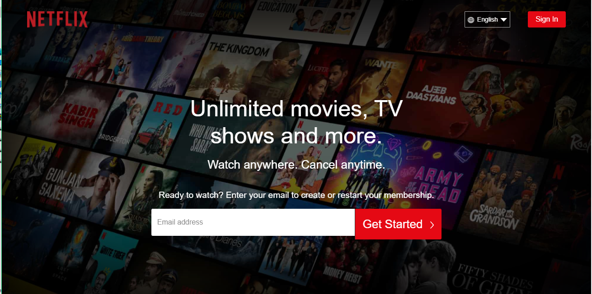
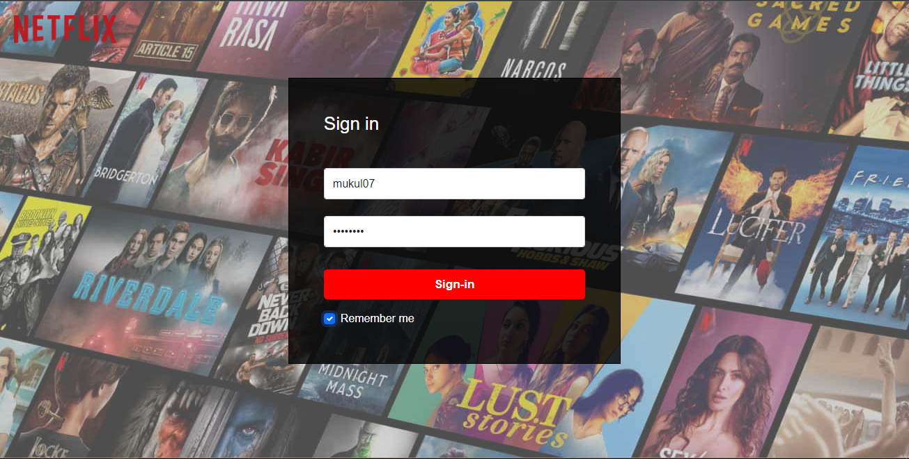
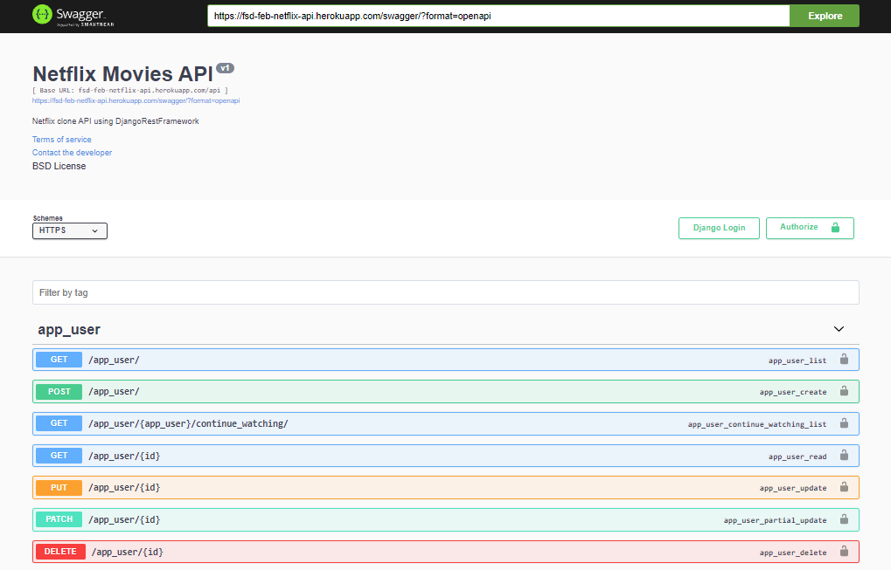

# Netflix-Clone-Django-React
View live on : https://fsd-netflix-clone.netlify.app/
## Backend  
Complete Backend for Netflix_Clone consisting of User Authentication using JWT in app user, custom permissions, custom pagination, CRUD operationality and a complete documentation of APIs built using Swagger and Re-Doc including deployment on Heroku and using Cloudinary for cloud storage(Media). 

### Technologies used :
Python |
Django |
Django Rest Framework |
Cloudinary |
Heroku

### View live backend on 
Swagger : https://fsd-feb-netflix-api.herokuapp.com/swagger/  
Re-doc : https://fsd-feb-netflix-api.herokuapp.com/redoc/

## Frontend  
Basic Frontend built in React JS using functional components consisting of reusable components, CSS - styled components & Bootstrap, using Fetch() to call APIs, Localstorage, JWT Token authentication. 

### Technologies used : 
Javascript |
React Js |
Bootstrap |
Netlify

### View live frontend on 
Netlify : https://fsd-netflix-clone.netlify.app/

### Preview
(please wait for the screenshot to load)

